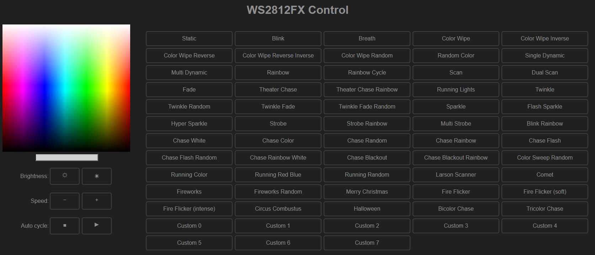
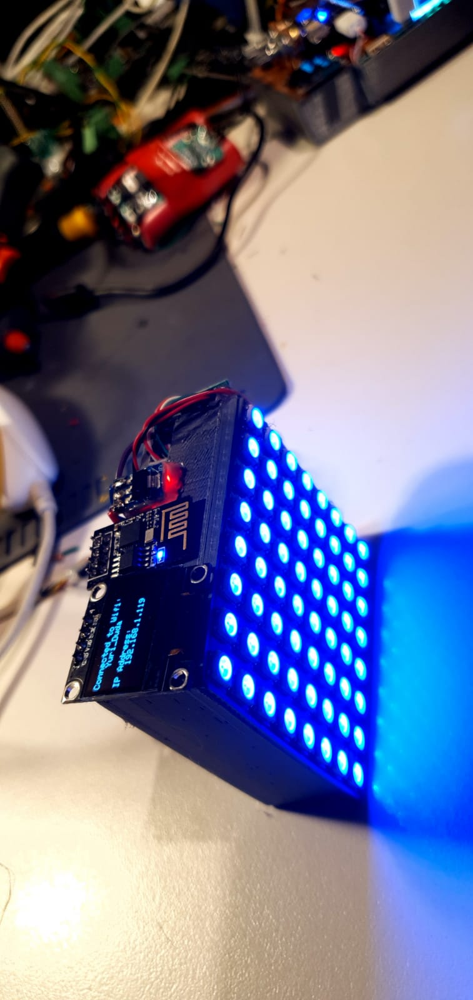
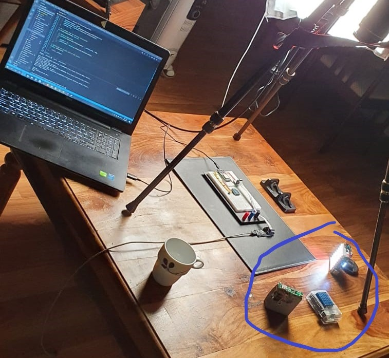
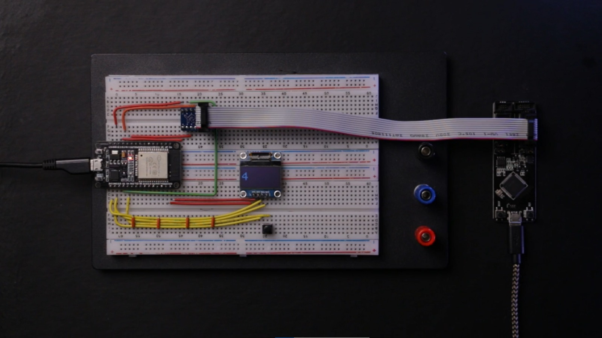

# WebLedStrip
This project is a little rechargeable lightbox that helps me to take nice pictures.

This project is based on Arduino and esp8266 (ESP-01).

Parts:

1x ESP-01

1x Bank Charger Control Board Micro USB

1x 8x8 RBG Matrix

1x 0.96-inch OLED IIC Serial White OLED Display

3x Lithium Battery

1x 3D printed box (https://github.com/Yuri-R-Studio/WebLedStrip/blob/master/Documentation/8x8%20matrix%20box%20v3.stl)

This box has a web page where you can set the color of the effect you need.

In order to find out what IP your board has got, I used a little I2C display and print the current IP when the board gets connected.

These lights are very useful when you want to add a small effect on the dark side of the picture.

Results:

